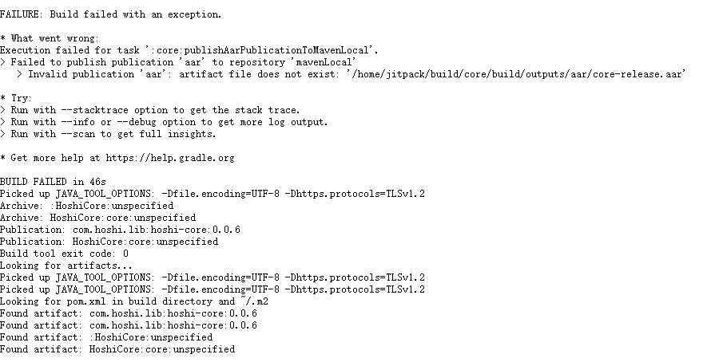

# HoshiCore [](https://github.com/996icu/996.ICU/blob/master/LICENSE_CN) [](https://996.icu)
Hoshi 纯净核心，仅依赖最低限度的官方库，不引入其它第三方库

## 使用说明
供个人使用的工具库，暂时未完善使用文档，后续梳理新增
## 如何引入
目前主要通过 Jitpack、本地 Maven 仓库或 AAR 引入，最推荐的是 Jitpack 方式
### 通过 Jitpack 引入
1. 进入 [Jitpack 官网](https://jitpack.io/)，搜索 `EndeRHoshI/HoshiCore`
2. 点击 Get it，准备跟随 How to 中说明的来做
3. Add the JitPack repository to your build file
   ```
   dependencyResolutionManagement {
       ositoriesMode.set(RepositoriesMode.FAIL_ON_PROJECT_REPOS)
       repositories {
            mavenCentral()
            maven { url 'https://jitpack.io' }
       }
   }  
   ```
4. Add the dependency
   ```
   dependencies {
       implementation 'com.github.EndeRHoshI:HoshiCore:Tag'
   }
   ```
   平时的引用，直接用 3、4 两步即可，这里写上 1、2 步只是写得更全一些，其中的 Tag 表示当前版本：[](https://jitpack.io/#EndeRHoshI/HoshiCore)
### 通过本地仓库引入
更换新的 Maven 本地打包方案后，这个引入方法可能有问题，还没研究。引入步骤如下：
1. 打包上传到本地 Maven 仓库，如果仓库中已有所需的版本，跳过该步骤

   详见[发布步骤](#发布步骤)

2. setting.gradle 或相关配置内添加仓库引用
    ```
    dependencyResolutionManagement {
        repositoriesMode.set(RepositoriesMode.PREFER_SETTINGS)
        repositories {
            ···
            mavenLocal() // 本地 Maven 仓库引用
        }
    }
    ```
3. 引入仓库并同步，仓库格式规则为：`${artifactGroup}:${artifactBuildId}:${artifactVersion}`
    ```
    implementation 'com.hoshi.lib:hoshi-core:0.0.7'
    ```
### 通过 AAR 包来引入
1. 下载 AAR

   可以在 [releases](https://github.com/EndeRHoshI/HoshiCore/releases) 下载，或者直接到本地仓库中取得，Windows 系统下默认本地 Maven 仓库地址：`C:\Users\userName\\.m2\repository\artifactGroup\artifactBuildId\artifactVersion`，Mac 还未处理好，相关问题还未知，打包生成 AAR 产物后直接用就好

2. 将 AAR 放到 app/src 同级的 libs 文件夹下，build.gradle 中引入 AAR 并同步
    ```
    implementation(files("./libs/hoshi-core-0.0.7.aar"))
    ```
   如果不使用 KTS，则是如下代码即可
    ```
    implementation fileTree(dir: 'libs', include: ['*.jar', '*.aar'])
    ```
## 发布步骤
1. 首先在 core 模块中写好代码
2. 在 app 模块中写测试代码，运行起来查看效果
3. 进行上传构建，这里分为两步，两步都要做
   1. 本地构建，上传到本地 Maven 仓库
      1. 在 Dependencies 的 Versions.coreVersion 中正确填写当前版本号
      2. 运行 Gradle 快捷指令列表中 Tasks 中的 publishing 中的 publishReleasePublicationTo\<MyRepo\>Repository
      3. 运行完成后，应该就有产物在项目的 build 文件夹中的 \<MyRepo\> 目录下生成
      4. 最好先在目标项目中引用并测试，测试没问题再继续下面的步骤，因为一旦出错，要重新打包的话，Jitpack 不能直接在原来的 tag 上再进行构建
   2. 使用 Jitpack 发布 
      1. 代码审查一下，检查一下提交有无问题，然后推送到远端仓库
      2. 在 AS 中的 Git 记录中右键添加 Tag
      3. 添加完后用指令 `git push origin <tagName>` 把 Tag 推到远端仓库
      4. 进入 Jitpack 官网，点一下 get it 让其构建，构建成功后，其它项目就可以引入了
4.  Github 上面创建 Release，指向刚刚的 Tag，并填写变更内容，同时上传本地构建的产物（这样使用 AAR 包来引入时可以直接下载来用）

### 注意
#### 为何推荐选择 Jitpack 或 Maven
尽量采用 Jitpack 或 Maven 仓库的方式发布并依赖，除非项目足够简单只需要引用 HoshiCore，否则使用 AAR 包的话，把 AAR 再打进另一个库（比如 HoshiArmor）并不是简单的事情

举个例子，之前尝试过，如果 HoshiCore 作为一个项目，打出一个 HoshiCore.aar 后，再由 HoshiArmor 引用，直接跑起来时是可以的，但是你要把 HoshiCore.aar 打进 HoshiArmor.aar 中，就比较麻烦，之前经过一些摸索，都没有处理好。目前似乎只能通过 fat-aar 来处理，但是 fat-aar 已经不维护了，而且处理起来还是非常麻烦，所以干脆尽量不要用 AAR 的方式了。

#### 本地 Maven 和 Jitpack 小插曲
上述步骤中的 3 存在一些差异，要区分本地 Maven 仓库的方式和 Jitpack 发布的方式，这是因为，在某次更新中，Jitpack 死活无法成功构建，报错如下，大致意思是运行 publishAarPublicationToMavenLocal 这个 task 时出了问题



具体原因不明，之前是没有问题的，但是既然出现了问题，那么我们区分一下，在需要本地打包时，才使用本地打包的配置，否则不作过多的引入，在不需要本地配置时，把 core lib 中的 build.gradle.kts 的 `apply("../local-maven.gradle")` 注释掉即可

然后在 20250807，通过 Google Developers 找到最新的最佳实践来进行本地 Maven 打包，完美解决了本地打包的问题，详见文章：[上传库](https://developer.android.com/build/publish-library/upload-library?hl=zh-cn#kts)
